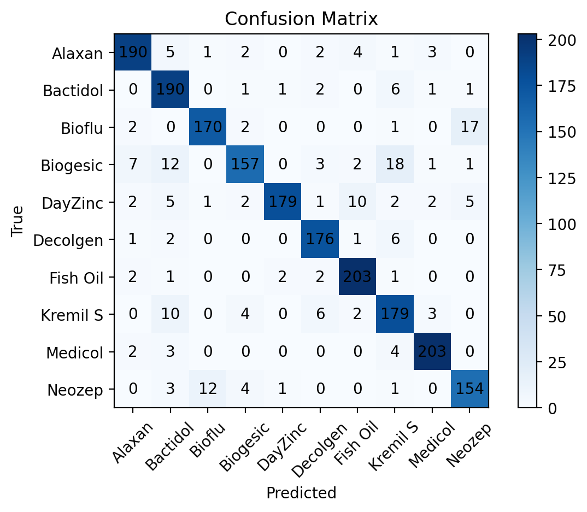

# Drug Vision – Image-Based Drug Classification

A deep learning project that classifies drug types from images using transfer learning with MobileNetV2.

---

## Project Overview

This project aims to automatically classify pharmaceutical products from images.  
Given an input image of a drug, the model predicts its class label along with a confidence score.

The system includes:
- Image classification model (MobileNetV2)
- Data preprocessing & augmentation pipeline
- Model evaluation with detailed metrics
- FastAPI-based web interface for real-time prediction

---

## Dataset

Dataset:  
https://www.kaggle.com/datasets/vencerlanz09/pharmaceutical-drugs-and-vitamins-synthetic-images

- 10 classes:
  - alaxan
  - bactidol
  - bioflu
  - biogesic
  - dayzinc
  - decolgen
  - fish oil
  - kemil s
  - medicol
  - neozep

- ~1000 images per class  
- Total: ~10,000 images

---

## Technologies Used

- Python  
- TensorFlow / Keras  
- MobileNetV2 (Transfer Learning)  
- NumPy, Pandas, Matplotlib  
- Scikit-learn  
- FastAPI  

---

## Model Architecture

- Base Model: MobileNetV2 (ImageNet pretrained)
- `include_top=False`
- GlobalAveragePooling2D
- Dense(128, ReLU)
- Dropout(0.2)
- Dense(num_classes, Softmax)

### Training Strategy
- Stage 1: Feature extraction (frozen base model)
- Stage 2: Fine-tuning (partial unfreeze)

---

## Results

- **Validation Accuracy:** ~90%  
- **Test Accuracy:** ~90%  
- **Top-3 Accuracy:** ~97% *(handles visually similar classes)*  

- Low overfitting observed  
- Stable training curves  

### Evaluation Includes
- Classification Report (precision, recall, f1-score)  
- Confusion Matrix  
- Hard-case analysis (most confused class pairs)  
- Top-K metrics (Top-1 / Top-3)

---

## Sample Output



---

## FastAPI Web Interface

A minimal web interface for real-time inference.

### Features

- Upload an image
- Displays:
  - Processed image (224×224)
  - Predicted label
  - Confidence score
  - Inference time (ms)
  - Top-3 predictions
- Confidence-based rejection:
  - Low confidence predictions are flagged as *"Not sure"*

### Metrics & Figures Page

The interface also includes a dedicated **Metrics & Figures** page:

- Displays:
  - Classification report
  - Test metrics
  - Top-K metrics
  - Hard-case analysis
- Visualizations:
  - Class distribution
  - Sample grid
  - Training curves
  - Confusion matrix

---

### Run the app

```bash
uvicorn app:app --reload

Then open:

http://127.0.0.1:8000
```
### Performance
Lightweight model (MobileNetV2)
Fast inference on CPU:
~30–50 ms per image (hardware dependent)

### Project Structure
Drug Vision/
│
├── outputs/
│   ├── best_model.keras
│   ├── classification_report.txt
│   ├── test_metrics.txt
│   ├── topk_metrics.txt
│   ├── hard_cases.txt
│   └── figures/
│       ├── confusion_matrix.png
│       ├── class_distribution.png
│       ├── sample_grid_16.png
│       └── training_curves.png
│
├── load_preprocess.py
├── model.py
├── evaluation.py
├── app.py
├── templates/
├── static/
└── README.md

### Disclaimer

This project is for educational purposes only.
It is not intended for medical use or real-world decision making.

### Limitations
Dataset consists of synthetic images
Performance may drop in real-world scenarios (domain shift)
Visually similar packaging may lead to misclassification

### Key Learnings
Transfer learning significantly improves performance
Data augmentation reduces overfitting
Fine-tuning boosts accuracy
Evaluation beyond accuracy (Top-k, confusion matrix) is critical
Confidence-based filtering improves system reliability
Simple UI + API integration turns models into usable products